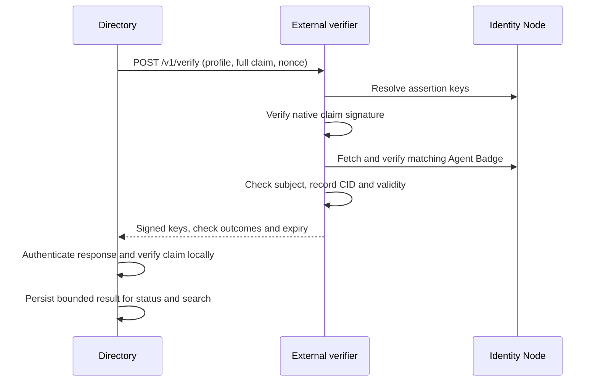

# Directory Identity Verifier (experimental)

This optional service is deployed alongside AGNTCY Identity Node. It adapts Node
identity and Agent Badge APIs to Directory's native identity claim verification.
Directory needs the client adapter from [dir#2292](https://github.com/agntcy/dir/pull/2292).
The service is a separate Go module; the Node's dependencies and API stay unchanged.



## Build and run

```sh
go -C integrations/directory-verifier test -race ./...
go -C integrations/directory-verifier build -o /tmp/directory-verifier ./cmd/verifier
```

| Setting | Meaning |
| --- | --- |
| `IDENTITY_NODE_URL` | Required administrator-selected HTTPS Node base URL |
| `RESULT_SIGNING_KEY_PATH` | Required RSA private key PEM, at least 2048 bits |
| `VERIFIER_BEARER_TOKEN_FILE` | Required shared token used by Directory |
| `IDENTITY_NODE_BEARER_TOKEN_FILE` | Optional token for a Node authentication gateway |
| `TLS_CERT_FILE`, `TLS_KEY_FILE` | Required HTTPS certificate and key |
| `SSL_CERT_FILE` / `SSL_CERT_DIR` | Optional private CA trust for the Node connection |
| `LISTEN_ADDRESS` | Default `:8443` |
| `VERIFIER_ID` | Default `agntcy-identity-verifier`; Directory pins this identifier |
| `RESULT_TTL` | Default `30m`; positive and at most `1h` |

Build the image from this directory with `docker build -t directory-verifier .`.
Mount keys, certificates and secret files at runtime. The service disables HTTP
redirects, bounds request/response size and call duration, and signs verification
results. `/healthz` is the only unauthenticated route. Temporary Node transport
failures return 503; authoritative failures return a signed negative result.

Configure Directory's identity reconciler with `agntcy.verifier_url`,
`verifier_trust_bundle_file` (public JWKS or PEM), `bearer_token_file`,
`require_agent_badge: true`, and time limits. Result-signing keys, agent assertion
keys and TLS roots are distinct trust inputs. The integration is disabled when
Directory has no verifier URL.

## Contract

The draft protocol is `agntcy.identity-verification.v2`; the wire types are in
`protocol`. Directory maintains its matching client types. The combined request:

```json
{
  "profile": "agntcy-agent-badge.v1",
  "subject": "agntcy://Agent-One",
  "signature": "<native detached JWS>",
  "payload": "<base64url native canonical claim JSON>",
  "nonce": "<64 hex characters>"
}
```

The native canonical payload contains `record_cid`, `role`, `subject`, `signed_at`
and `expires_at`, in that order. Unknown fields and noncanonical payloads fail.
The signed response covers protocol, operation, verifier, profile, policy,
`checks.identity`, `checks.badge`, aggregate `verified`, `publicKeys`, exact subject
and CID, SHA-256 digest of compact request JSON, `checkedAt` and `expiresAt`.
Request digests bind the profile, payload, agent signature and fresh nonce.
The response envelope is `{ "resultJws": "<embedded compact JWS>" }`.

`agntcy-agent-badge.v1` requires both checks. Explicit
`agntcy-agent-control.v1` checks identity control and returns keys without fetching
badges. `/v1/resolve` remains available for key-only callers; normal Directory
reconciliation calls only `/v1/verify`, once per candidate claim. One request to
this service can make several internal Node calls.

Node calls use `/v1alpha1/id/resolve`,
`/v1alpha1/vc/<id>/.well-known/vcs.json` and `/v1alpha1/vc/verify`. Only public keys
referenced by the identity's `assertionMethod` are authorized. A valid Agent Badge
must have type `AgentBadge`, exact `credentialSubject.id`, and an embedded
`credentialSubject.badge` with the claim's Directory CID. Supplied credential and
JWT validity dates are enforced; badge expiry bounds the signed observation.
The service stores no record, claim or badge.

### Trust policy

Policy `subject-key-badge.v1` names the reference Node's subject-key-backed badge
verification. It proves control and exact record consistency. It does not establish
independent issuer accreditation or implement external credential status-list
revocation. A stronger deployment needs a separately specified policy and trust
implementation. KMS/HSM result signing is a future adapter.

OIDC/Keycloak authenticates enrollment and badge publication to Node; it does not
replace the native claim signature or issue the Agent Badge itself. Agent signing
keys must already be authorized by the resolved identity.

## Live verification

Directory includes a reproducible live harness at `tests/e2e/agntcy`. It runs real
Keycloak, PostgreSQL, Identity Node, this service, Directory daemon and embedded
OCI registry. It checks successful verification/search, wrong signer, different
CID, expired badge, verifier outage and recovery. Its TLS proxy only terminates
TLS for Node's HTTP listener; identity and credential operations use real Node.
Until the Node controller fix [identity#181](https://github.com/agntcy/identity/pull/181)
is merged, build Node from that draft's branch for the live harness.
